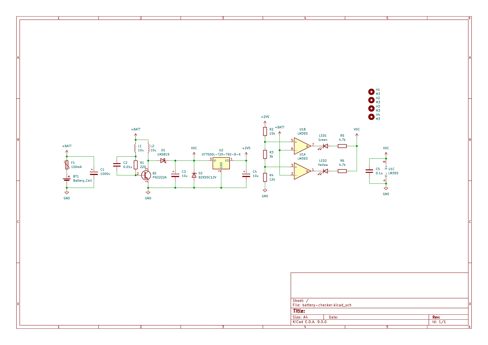
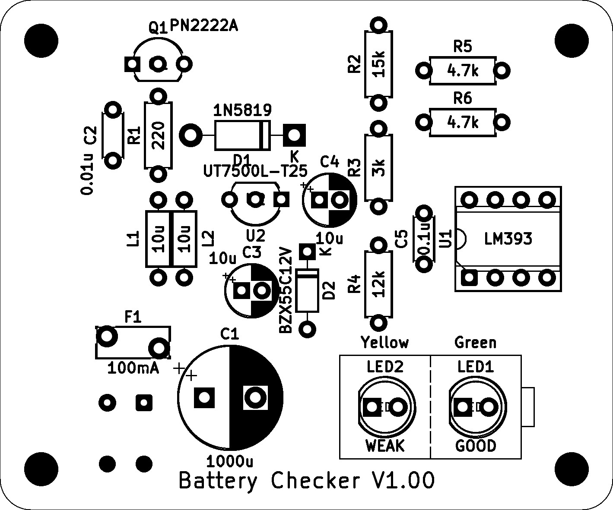

# 1.5Vバッテリーチェッカーキット

## 概要
1.5V電池の残量を2段階で表示するバッテリーチェッカーキットです。

1.5Vの電池であれば、どんな形状でも残量をチェックすることができます。

被測定電池から電源を取るため、本体に電池が不要です。

## 購入
この製品は以下のサイトから購入できます。  

#### 取扱説明書

<table>
  <thead>
    <tr>
      <th>バージョン</th>
      <th>URL</th>
    </tr>
  </thead>
  <tbody>
    <tr>
        <td>最新版</td>
        <td><a href="./manual_8202_20240919.pdf">manual_8202_20240919.pdf</a></td>
    </tr>
  </tbody>
</table>

#### お問い合わせフォーム
[製品に関するお問い合わせ](https://forms.gle/Fn5E3byABXJ8P5sbA)

## 使用方法
赤色のクリップを電池の＋側、黒色のクリップを電池の－側に接続します。

緑色と黄色ランプが点灯している時は電池がおよそ1.2V以上あり、電池残量は良好です。

黄色ランプのみ点灯している時は電池がおよそ0.9V以上で、電池残量は少ないです。

ランプが点灯していない時は電池がおよそ0.9V未満で、電池残量が非常に少ない状態です。

電池は逆に接続しないでください。故障の原因となります。

## 回路図

## 実装図

## 実装例

